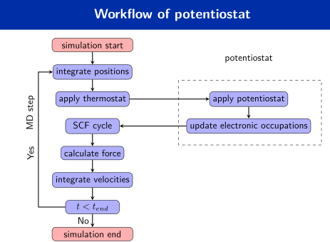
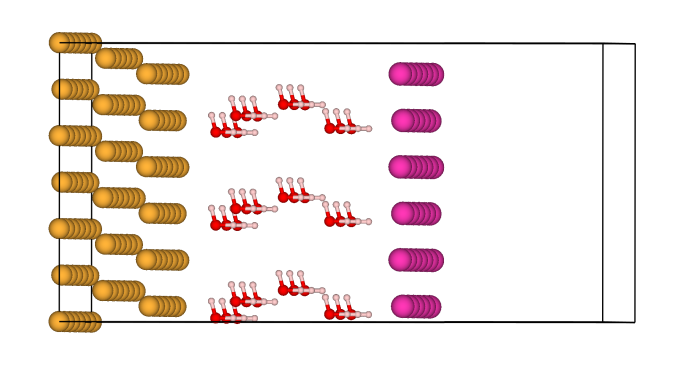
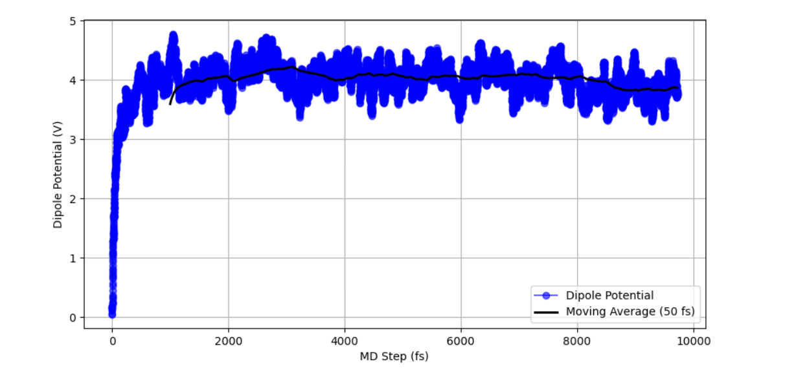

# Potentiostat_cp2k_implementation

This repository serves as a tutorial for implementing functionalities in [CP2K](https://github.com/cp2k/cp2k).  
Currently, the repository contains benchmarks and the workflow of the algorithm.

The full code and an in-depth explanation of the changes will be added to the repository once the paper is published.

## Code Workflow and Benchmarks

The code workflow and benchmarks for the gold-water system are shown below:

Worflow for the thermopotentiostat
  

Structure 

Dipole Potential vs number of MD steps(time)

